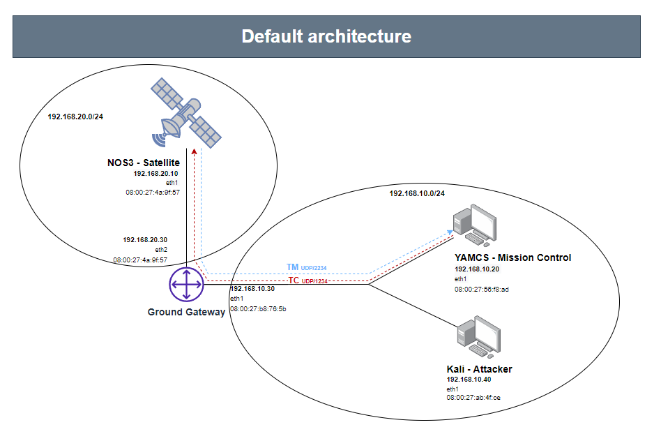

# CCSDS Satellite Cybersecurity Lab

A reproducible laboratory for studying the security of satellite communications using **NOS3** and **Yamcs**.

The platform reproduces a simplified ground-to-space architecture composed of independent virtual machines representing a **Mission Control Center**, **Ground Station**, **Satellite**, and **Attacker**. It can be used to observe telemetry and telecommand traffic, perform network and protocol attacks, and evaluate defensive mechanisms in a controlled environment.

---

# Features

- Reproducible deployment with Vagrant
- Multi-VM satellite communication architecture
- NOS3 satellite simulation
- cFS Flight Software
- Yamcs Mission Control
- CCSDS Telemetry (TM) and Telecommands (TC)
- Man-in-the-Middle attacks
- Replay attacks
- Telecommand forgery
- Traffic dropping / Denial of Service
- Detection and mitigation examples

---

# Lab Architecture

The laboratory separates each major component into an independent virtual machine in order to reproduce a realistic communication chain.

| VM | Role | Network | IP |
|----|------|---------|----|
| `mc` | Mission Control (Yamcs) | MC-LAN | `192.168.10.20` |
| `gs` | Ground Station / Router | MC-LAN | `192.168.10.30` |
| `gs` | Ground Station / Router | SPACE-LAN | `192.168.20.30` |
| `sat` | Satellite (NOS3) | SPACE-LAN | `192.168.20.10` |
| `kali` | Attacker | MC-LAN | `192.168.10.40` |

## Network Diagram



## NOS3 Internal Architecture

*Faut rajouter internal NOS3 architecture diagram ici.*

The satellite VM executes NOS3 through multiple Docker containers. The main components are:

- cFS Flight Software
- Radio Simulator
- NOS Engine
- 42 Dynamics Simulator
- Truth42
- Hardware simulators

Telemetry flows from **cFS → Radio Simulator → Yamcs**, while telecommands follow the opposite direction.

---

## Main Communication Flows

| Flow | Protocol | Destination |
|------|----------|-------------|
| Truth Data | UDP 5111 | Yamcs |
| Radio Telemetry | UDP 6011 | Yamcs |
| Radio Telecommands | UDP 8010 | Radio Simulator |

---

# Requirements

## Supported Platforms

- Linux
- Windows using WSL2

## Required Software

- Git
- Vagrant
- VirtualBox

Ubuntu & Debian:

```bash
sudo apt update
sudo apt install -y git vagrant virtualbox
```

---

# Installation & Deployment

Clone the repository.

```bash
git clone https://github.com/BaptisteBemel/satellite_lab_cybersecurity.git
cd ccsds_satellite_cybersecurity_lab
```

Start the laboratory.

```bash
vagrant up
```

The first deployment may take some time because NOS3 and Yamcs are built automatically.

---

## Verification

Verify that the deployment completed successfully.

```bash
./verification.sh
```

The verification script checks:

- VMs are running
- Routing configuration
- Docker containers
- NOS3 services
- Yamcs service
- API availability
- Telemetry flows
- Radio configuration

---

# Repository Structure

```text
.
├── attacks/
├── defense/
├── provisioning/
├── captures/
├── verification.sh
├── Vagrantfile
└── README.md
```

| Directory | Description |
|-----------|-------------|
| `attacks/` | Attack scripts |
| `defense/` | Detection and mitigation utilities |
| `provisioning/` | VM provisioning scripts |
| `captures/` | Generated PCAPs and extracted traffic |
| `verification.sh` | Platform verification |
| `Vagrantfile` | Lab deployment |

---
# Usage Scenarios

The following scenarios demonstrate the main attack and defense capabilities of the laboratory.

---

# Scenario 1 — Baseline Communication Analysis

## Objective

Establish a reference state before introducing attacks.

This scenario verifies that:

- Mission Control can receive telemetry.
- The satellite simulation is operational.
- Normal TM and TC communication paths are working.
- Network behavior can be captured and analyzed.

## Scripts involved

| Script | Purpose |
|--------|---------|
| `defense/check_neighbors.sh` | Display legitimate network neighbors and MAC addresses |
| `defense/capture_defense.sh` | Capture normal laboratory traffic |
| `defense/analyze_pcap.py` | Generate a summary of captured traffic |
| `defense/extract_tm_from_pcap.py` | Extract CCSDS telemetry frames |

## Execution

Check the network state:

```bash
vagrant ssh mc -c "/vagrant/defense/check_neighbors.sh"
```

Capture baseline traffic:

```bash
vagrant ssh mc -c "/vagrant/defense/capture_defense.sh eth1 /vagrant/captures/baseline.pcap 10"
```

Analyze captured traffic:

```bash
vagrant ssh mc -c "/vagrant/defense/analyze_pcap.py /vagrant/captures/baseline.pcap"
```

Extract captured traffic:

```bash
vagrant ssh mc -c "/vagrant/defense/extract_tm_from_pcap.py /vagrant/captures/baseline.pcap -o /vagrant/captures/baseline"
```
---

# Scenario 2 — Man-in-the-Middle Attack

## Objective

Place the attacker between Mission Control and the Ground Station in order to intercept bidirectional communication.

The attack targets the Mission Control LAN and uses ARP spoofing to create a MITM position.

The attacker can observe:

- Telemetry
- Telecommand

## Scripts involved

| Script | Purpose |
|--------|---------|
| `attacks/mitm_start.sh` | Launch bidirectional ARP spoofing |
| `attacks/capture_satcom.sh` | Capture intercepted satellite communication |
| `defense/detect_arp_spoof.py` | Detect ARP mapping changes |

## Execution
Start ARP spoofing from Kali:

```bash
vagrant ssh kali -c "/vagrant/attacks/mitm_start.sh eth1"
```

Capture intercepted traffic:

```bash
vagrant ssh kali -c "/vagrant/attacks/capture_satcom.sh eth1 /vagrant/captures/mitm.pcap 15"
```
---

# Scenario 3 — Telemetry Capture and Extraction

## Objective

Capture and extract telemetry frames from the attacker position.

This scenario demonstrates that an attacker with network access can observe unprotected telemetry traffic.

## Scripts involved

| Script | Purpose |
|--------|---------|
| `attacks/capture_satcom.sh` | Capture telemetry traffic |
| `defense/extract_tm_from_pcap.py` | Extract CADUs and TM Transfer Frames |
| `defense/analyze_pcap.py` | Analyze captured traffic |

## Execution

Capture telemetry:

```bash
vagrant ssh kali -c "/vagrant/attacks/capture_satcom.sh eth1 /vagrant/captures/tm_capture.pcap 15"
```

Extract telemetry frames:

```bash
vagrant ssh mc -c "/vagrant/defense/extract_tm_from_pcap.py /vagrant/captures/tm_capture.pcap -o /vagrant/captures/tm_extracted"
```
---

# Scenario 4 — Telemetry Replay

## Objective

Replay previously captured telemetry toward Mission Control.

This scenario demonstrates the absence of telemetry authentication and anti-replay protection.

## Scripts involved

| Script | Purpose |
|--------|---------|
| `attacks/replay_radio_tm.py` | Replay captured telemetry frames |
| `attacks/capture_satcom.sh` | Generate telemetry captures |

## Execution

Replay captured telemetry:

```bash
vagrant ssh kali -c "/vagrant/attacks/replay_radio_tm.py /vagrant/captures/tm_capture.pcap --dst-ip 192.168.10.20 --dst-port 6011"
```

---

# Scenario 5 — Telecommand Capture

## Objective

Capture telecommands sent from Mission Control toward the simulated satellite.

This scenario demonstrates that unprotected telecommand traffic can be observed and extracted.

## Scripts involved

| Script | Purpose |
|--------|---------|
| `attacks/capture_tc_commands.sh` | Capture telecommand traffic |
| `attacks/extract_tc_from_pcap.py` | Extract raw telecommand payloads |

## Execution

Capture telecommands:

```bash
vagrant ssh kali -c "/vagrant/attacks/capture_tc_commands.sh eth1 /vagrant/captures/tc_capture.pcap 20"
```

Extract payloads:

```bash
vagrant ssh kali -c "/vagrant/attacks/extract_tc_from_pcap.py /vagrant/captures/tc_capture.pcap -o /vagrant/captures/tc_extracted"
```

---

# Scenario 6 — Telecommand Replay and Injection

## Objective

Inject previously captured telecommands into the satellite communication channel.

This scenario demonstrates that captured commands can potentially be replayed without cryptographic authentication.

## Scripts involved

| Script | Purpose |
|--------|---------|
| `attacks/send_tc_payload.py` | Send raw telecommand payloads |
| `attacks/extract_tc_from_pcap.py` | Extract command payloads |

## Execution

Send a captured telecommand:

```bash
vagrant ssh kali -c "/vagrant/attacks/send_tc_payload.py /vagrant/captures/tc_extracted/payload.bin --dst-ip 192.168.20.10 --dst-port 8010"
```

---

# Scenario 7 — Telecommand Forgery

## Objective

Modify an existing telecommand and generate a new valid-looking command.

This scenario demonstrates that a checksum alone does not provide cryptographic authentication.

## Scripts involved

| Script | Purpose |
|--------|---------|
| `attacks/forge_tc_from_template.py` | Modify TC fields and regenerate checksum |
| `attacks/send_tc_payload.py` | Inject forged command |

## Execution

Generate a forged command:

```bash
vagrant ssh kali -c "/vagrant/attacks/forge_tc_from_template.py <input_tc.bin> -o forged_tc.bin --seq-count 42"
```

Inject the forged command:

```bash
vagrant ssh kali -c "/vagrant/attacks/send_tc_payload.py forged_tc.bin --dst-ip 192.168.20.10 --dst-port 8010"
```

---

# Scenario 8 — Communication Disruption

## Objective

Interrupt telemetry or telecommand communication by dropping selected traffic.

## Scripts involved

| Script | Purpose |
|--------|---------|
| `attacks/drop_radio_tm.sh` | Drop telemetry traffic |
| `attacks/drop_tc_commands.sh` | Drop telecommands |
| `attacks/restore_forwarding.sh` | Restore normal forwarding |

## Execution

Drop telemetry:

```bash
vagrant ssh kali -c "/vagrant/attacks/drop_radio_tm.sh"
```

Restore communication:

```bash
vagrant ssh kali -c "/vagrant/attacks/restore_forwarding.sh"
```

---

# Scenario 9 — Detection and Mitigation

## Objective

Evaluate defensive mechanisms against the implemented attacks.

## Scripts involved

| Script | Purpose |
|--------|---------|
| `defense/detect_arp_spoof.py` | Detect ARP poisoning |
| `defense/static_arp_add.sh` | Configure static ARP entries |
| `defense/static_arp_del.sh` | Remove static ARP entries |

## Execution

Start ARP monitoring:

```bash
vagrant ssh mc -c "sudo /vagrant/defense/detect_arp_spoof.py --iface eth1"
```

Enable static ARP protection:

```bash
vagrant ssh mc -c "/vagrant/defense/static_arp_add.sh eth1 192.168.10.30 <GS_MAC>"
vagrant ssh gs -c "/vagrant/defense/static_arp_add.sh eth1 192.168.10.20 <MC_MAC>"
```

---

# Troubleshooting


## DNS issues

Inside the VM:

```bash
sudo bash -c 'echo "nameserver 8.8.8.8" > /etc/resolv.conf'
sudo apt update
```

---


## Docker storage full

Check usage.

```bash
docker system df
```

Remove unused data.

```bash
docker system prune -af
```

---

# Cleanup

Stop any running attacks.

```bash
vagrant ssh kali -c "sudo pkill arpspoof"
```

Restore forwarding.

```bash
vagrant ssh kali -c "./attacks/restore_forwarding.sh"
```

Disable IP forwarding.

```bash
vagrant ssh kali -c "sudo sysctl -w net.ipv4.ip_forward=0"
```

Flush ARP cache if necessary.

```bash
vagrant ssh mc -c "ip neigh flush all"
vagrant ssh gs -c "ip neigh flush all"
```


